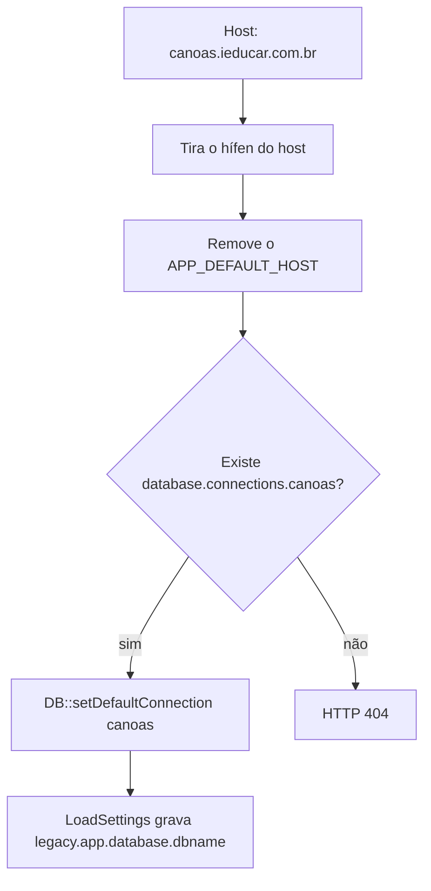

# Multi-tenant: uma instalação, um banco por instituição

> **Tipo:** Guia de infraestrutura · **Módulo:** Conexão, configuração e pacotes · **Público:** quem desenvolve ou opera o i-Educar  
> **Índice:** [Documentação](../README.md)

O mesmo código atende vários municípios. Cada instituição tem o **próprio banco PostgreSQL**. O pedido HTTP escolhe esse banco pelo domínio; em seguida o nome do banco fica em `config('legacy.app.database.dbname')`. Pacote, menu, seed ou regra que dependem desse valor só valem para a instituição conectada.

---

## Índice

| Parte | Conteúdo |
|-------|----------|
| [Como o pedido escolhe o banco](#como-o-pedido-escolhe-o-banco) | Domínio, conexão e `dbname` |
| [O que `dbname` é](#o-que-dbname-é) | Valor real depois do `LoadSettings` |
| [Onde ler o valor](#onde-ler-o-valor) | HTTP, fila e Artisan |
| [Pacote ou opção de uma instituição](#pacote-ou-opção-de-uma-instituição) | Três formas que não vazam para as outras |
| [O que não isola](#o-que-não-isola) | Provider, cache e migration global |

---

## Como o pedido escolhe o banco

Com `APP_MULTI_TENANT=true`, o middleware global `ConnectTenantDatabase` roda em todo pedido, antes do `LoadSettings`.



O nome da conexão é o subdomínio, sem hífen, sem o host padrão (`APP_DEFAULT_HOST`, por omissão `ieducar.com.br`). `canoas.ieducar.com.br` usa a conexão `canoas`. `sao-jose.ieducar.com.br` usa `saojose`.

Essa conexão precisa existir em `config/database.php` (ou num ficheiro de configuração carregado para `database.connections`). Cada entrada aponta para o PostgreSQL daquela instituição. Se `APP_MULTI_TENANT` está ativo e o host não tem conexão, a resposta é 404. Com multi-tenant desligado, o pedido segue na conexão padrão do `.env`.

`LoadSettings` lê a conexão já escolhida e publica:

| Chave | Origem |
|-------|--------|
| `legacy.app.database.hostname` | `host` da conexão |
| `legacy.app.database.port` | `port` |
| `legacy.app.database.dbname` | `database` (nome do banco PostgreSQL) |
| `legacy.app.database.username` | `username` |
| `legacy.app.database.password` | `password` |

O `dbname` é o nome do **banco**, não o subdomínio. A conexão pode chamar-se `canoas` e o banco `ieducar_canoas`. A comparação de instituição usa o nome do banco.

---

## O que `dbname` é

Em `config/legacy.php` o valor inicial é `env('DB_DATABASE')`, o banco da conexão padrão. Isso vale até o `LoadSettings`.

No pedido HTTP a ordem é:

1. A tabela `settings` **desse** banco é aplicada com `Config::set`.
2. As configurações gerais da instituição ativa são aplicadas.
3. `getDatabaseConfig()` corre por último e **substitui** `legacy.app.database.dbname` pelo banco da conexão atual.

Uma linha `legacy.app.database.dbname` na tabela `settings` não define o tenant. O middleware volta a gravar o nome vindo da conexão. A tabela `settings` continua a ser o lugar certo para opções da instituição (`legacy.report.*`, textos, flags), porque cada banco tem a sua cópia.

Dentro de um banco há uma instituição ativa (`pmieducar.instituicao`). O multi-tenant separa **municípios** (bancos). Escola, curso ou utilizador dentro do mesmo banco não mudam de tenant.

---

## Onde ler o valor

### Pedido HTTP

`ConnectTenantDatabase` e `LoadSettings` estão no middleware global, antes do controller. Numa rota, controller, listener disparado pelo pedido ou view, o valor já é o banco da instituição:

```php
$banco = config('legacy.app.database.dbname');

if ($banco === 'ieducar_canoas') {
    // só esta instituição
}
```

Arquivos enviados usam esse nome como pasta (`FileService`). O cache de menu usa o mesmo nome como tag, para um município não ler o menu de outro.

### Artisan e fila

O middleware **não** corre no CLI nem no worker. `config('legacy.app.database.dbname')` fica no `DB_DATABASE` do `.env`, mesmo que o job troque a conexão.

Depois de `DB::setDefaultConnection($conexao)` (ou dentro de `Connections::eachConnection`), leia o banco da conexão ativa e, se o restante do código consulta a config, atualize-a:

```php
$banco = DB::connection()->getConfig('database');

Config::set('legacy.app.database.dbname', $banco);
```

`query:all` percorre as conexões de `config('database.connections')`, exceto os drivers genéricos (`pgsql`, `mysql`, `sqlite`, `sqlsrv`, `mariadb`, `audit`, `bussolastaging`). `TenantsJob` despacha um job por conexão; o job filho precisa fixar a conexão e o `dbname` como acima. O comando Artisan, sem isso, só vê o banco do `.env`.

---

## Pacote ou opção de uma instituição

O código do pacote é o mesmo em todos os domínios. O que muda é **quando** a função liga e **em que banco** os dados foram gravados.

### 1. Dados só no banco da instituição

Menu, permissão, parâmetro em `settings` ou seed corridos com a conexão dessa instituição existem apenas lá. Os outros bancos não têm a linha. É a forma que menos depende de `if` no código.

```bash
# DB_CONNECTION e --database iguais: o seed chamado de dentro das migrations
# usa a conexão padrão do processo, não só o --database do migrate
DB_CONNECTION=canoas php artisan migrate --database=canoas --force
DB_CONNECTION=canoas php artisan db:seed --class=Database\\Seeders\\OpcaoDoMunicipioSeeder --database=canoas
```

Confira o nome em `database.connections.canoas.database`. O `--database` do Artisan é o **nome da conexão**, não o `dbname`. O passo a passo do localhost, com tenant 2 zerado, está em [Implementação no localhost](MULTI-TENANT-IMPLEMENTACAO.md).

### 2. Pacote instalado, ligado só em alguns tenants

O código fica no mesmo deploy. `config/tenants.php` lista as conexões em que o pacote existe. No provider, `PackageTenant::allows('fornecedor/pacote')` decide o `if` / `else`: carrega migration e tela, ou devolve `null` e o módulo não aparece naquele host. A leitura da conexão no pedido tem de ficar dentro do callback, depois do middleware. Detalhe e exemplo no [guia de implementação](MULTI-TENANT-IMPLEMENTACAO.md).

### 3. Comportamento condicionado ao `dbname`

A função fica no pacote partilhado e só executa para um banco. A leitura tem de acontecer **depois** do `LoadSettings` (pedido) ou depois do `Config::set` manual (fila e comando).

```php
public function handle(): void
{
    if (config('legacy.app.database.dbname') !== 'ieducar_canoas') {
        return;
    }

    // rota, comando de tela, cálculo ou publicação visível só em Canoas
}
```

Vários bancos, se precisarem da mesma função, entram numa lista explícita. Não use o subdomínio: ele pode diferir do nome do banco.

### 4. Esquema comum, uso local

A migration do pacote pode criar tabela em todos os bancos quando o deploy percorre as conexões. A tabela vazia não liga a função. Quem liga é o seed, a linha em `settings` ou o `if` do `dbname` no banco certo.

Não condicione o `up()` da migration ao `config('legacy.app.database.dbname')` lido no arranque do Artisan: nesse momento o valor ainda é o do `.env`, e um `migrate` único aplicaria o esquema só ao banco padrão.

---

## O que não isola

| Leitura | Resultado |
|---------|-----------|
| `config('legacy.app.database.dbname')` dentro de `ServiceProvider::register()` ou `boot()` | Ainda é `DB_DATABASE` do `.env`. O middleware ainda não corre. Um `if` ali liga ou desliga o pacote para **todos** os hosts do processo. |
| Cache, fila ou arquivo sem o nome do banco na chave | Um município pode ler ou apagar dado de outro. O menu já prefixa com `dbname`; código novo deve fazer o mesmo. |
| `flush` pelo valor antigo da config, com a conexão já trocada | `MenuCacheService::flushAll` usa `DB::connection()->getConfig('database')`, a conexão real. Prefira essa leitura quando a config ainda não foi atualizada. |
| Flag na tabela `settings` esperando que ela troque o tenant | O `LoadSettings` repõe `dbname` a partir da conexão. A flag serve para opção de negócio, não para escolher o banco. |
| Várias escolas no mesmo banco | Continua um único `dbname`. Restringir uma escola é filtro de `cod_escola` ou permissão, não multi-tenant. |

---

## Ver também

- [Documentação](../README.md)
- [Implementação no localhost](MULTI-TENANT-IMPLEMENTACAO.md) — tenant 1, tenant 2 e transporte só no primeiro
- [Comandos em produção](COMANDOS-PRODUCAO.md) — caches, migrações e o efeito da tabela `settings` por instalação
