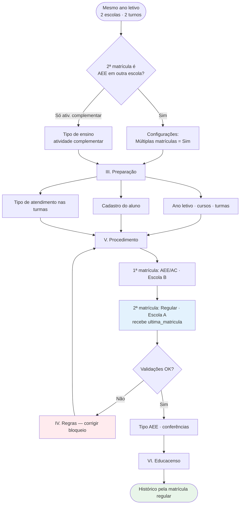

# Matrícula dupla no mesmo ano letivo

> **Tipo:** Guia operacional · **Módulo:** Escola (matrícula e enturmação) · **Público:** Secretaria escolar, SME, suporte  
> **Cenário:** Regular + AEE ou atividade complementar · Escolas e turnos diferentes · Mesmo ano letivo  
> **Índice:** [Documentação](../README.md)

---

## Índice

| Parte | Conteúdo |
|-------|----------|
| [I. Introdução](#i-introdução) | Visão geral, cenário e fluxograma |
| [II. Fundamentos](#ii-fundamentos) | Modelo matrícula / enturmação no i-Educar |
| [III. Preparação](#iii-preparação) | Configuração, estrutura escolar e aluno |
| [IV. Regras do sistema](#iv-regras-do-sistema) | Validações automáticas antes e durante o cadastro |
| [V. Procedimento](#v-procedimento) | Passo a passo na ordem do menu Escola |
| [VI. Censo e documentos](#vi-censo-e-documentos) | Educacenso, histórico e relatórios |
| [VII. Referência](#vii-referência) | Checklist, código-fonte e resumo |

---

## I. Introdução

### Visão geral

O i-Educar trata **matrícula** e **enturmação** em camadas distintas:

| Camada | Pergunta que responde | Onde fica |
|--------|----------------------|-----------|
| **Matrícula** | O aluno está vinculado à escola, curso, série e ano? | `pmieducar.matricula` |
| **Enturmação** | Em qual turma, desde quando (e até quando)? | `pmieducar.matricula_turma` |

Neste cenário o aluno possui **duas matrículas ativas** no **mesmo ano letivo**:

| Matrícula | Finalidade | Tipo de turma |
|-----------|------------|---------------|
| **Principal (regular)** | Histórico, boletim, etapa de ensino no Censo | Curricular (etapa de ensino) |
| **Complementar** | AEE ou atividade complementar | AEE **ou** Atividade complementar |

> **Regra prática:** não misturar série regular e AEE na mesma matrícula. São dois registros em `matricula`, cada um com sua enturmação.

### Cenário de uso

**Exemplo**

| | Escola A | Escola B |
|---|----------|----------|
| **Oferta** | 3º ano EF (regular) | AEE ou atividade complementar |
| **Turno** | Matutino | Vespertino |
| **Papel** | Matrícula para histórico | Segunda matrícula (Censo / atendimento) |

**Requisitos**

- Mesmo **ano letivo** (ex.: 2026).
- **Escolas diferentes** (mesma rede ou instituições distintas).
- **Turnos diferentes** (recomendado; reduz conflito de horário).
- Uma matrícula **regular**; a outra **AEE** ou **atividade complementar**.

### Fluxograma geral



---

## II. Fundamentos

### Modelo no i-Educar

| Conceito | Descrição | Tela / tabela |
|----------|-----------|---------------|
| **Matrícula** | Vínculo aluno ↔ escola, curso, série, ano | Escola → Matrículas → Novo · `educar_matricula_cad.php` |
| **Enturmação** | Vínculo matrícula ↔ turma | Na matrícula ou Enturmar · `educar_matricula_turma_cad.php` |
| **Última matrícula** | Flag `ultima_matricula` (histórico, avanço de ano) | Automática ao cadastrar |
| **Tipo de atendimento (turma)** | Curricular `0` · Ativ. complementar `4` · AEE `5` | Cadastro da turma · `turma.tipo_atendimento` |
| **Tipo de AEE (aluno)** | Detalhamento na enturmação AEE (Censo reg. 60) | Matrícula → Tipo do AEE · `educar_matricula_turma_tipo_aee_cad.php` |

**Tipos de atendimento da turma** (`TipoAtendimentoTurma`):

| Código | Nome | Uso neste guia |
|--------|------|----------------|
| `0` | Curricular (etapa de ensino) | Turma da matrícula **regular** |
| `4` | Atividade complementar | Segunda matrícula (alternativa ao AEE) |
| `5` | AEE | Segunda matrícula (atendimento especializado) |

### O que alimenta o quê

```
┌─────────────────┐     ┌──────────────────┐
│  Matrícula      │────▶│  Enturmação      │
│  (escola/curso) │     │  (turma/turno)   │
└────────┬────────┘     └────────┬─────────┘
         │                       │
         ▼                       ▼
   ultima_matricula         tipo_atendimento
   (histórico)              (AEE na enturmação)
         │                       │
         └───────────┬───────────┘
                     ▼
              Educacenso reg. 60
              Histórico / boletim
```

---

## III. Preparação

Siga a ordem abaixo **antes** de abrir **Matrícula → Novo**. Corresponde ao caminho: **Instituição → Escola → Turmas → Aluno**.

### 1. Configurações da rede

#### Instituição

**Menu:** Configurações → Instituição

| Campo | Orientação |
|-------|------------|
| **Não permitir múltiplas enturmações… (mesmo curso e série/ano)** | Impede duas enturmações na **mesma** matrícula. Este guia usa **duas matrículas**; em escolas diferentes em geral não bloqueia. |

#### Configurações do sistema

**Menu:** Configurações → Validações de sistema

| Configuração | Chave | Valor para AEE em outra escola |
|--------------|-------|----------------------------------|
| **Permitir múltiplas matrículas?** | `legacy.app.matricula.multiplas_matriculas` | **Sim** (`1`) |
| Padrão do sistema | — | **Não** (`0`) |

> Para **atividade complementar** em curso com `tipo_ensino.atividade_complementar = true`, a segunda matrícula pode ser permitida **mesmo com múltiplas matrículas = Não** (exceção no código).

### 2. Estrutura escolar (ambas as escolas)

#### Escola A — matrícula regular

| Item | Requisito |
|------|-----------|
| Ano letivo | **Em andamento** |
| Curso / série | Etapa de ensino (ex.: EF 3º ano) |
| Turma | Tipo **Curricular**; etapa Educacenso coerente |
| Turma (Censo) | Mediação presencial, dias da semana, horários e datas do ano letivo preenchidos (se a rede valida Censo) |

#### Escola B — AEE ou atividade complementar

**AEE**

| Item | Requisito |
|------|-----------|
| Curso | *Atendimento Educacional Especializado - AEE* (`AeeSeeder` ou manual) |
| Série | *AEE* |
| Turma | Tipo **AEE (5)** — obrigatório para horário e exportação |
| Vínculos | `escola_curso`, `escola_serie`, ano letivo da escola |

**Atividade complementar**

| Item | Requisito |
|------|-----------|
| Curso | Tipo de ensino com **atividade complementar = true** |
| Turma | Tipo **Atividade complementar (4)** |

> **Atenção:** turmas criadas só pelo `AeeSeeder` podem vir **sem** `tipo_atendimento` AEE. Edite a turma antes de enturmar.

### 3. Cadastro do aluno

**Menu:** Cadastros → Aluno

| Campo | Quando preencher |
|-------|------------------|
| Deficiências / transtornos | Aluno em AEE |
| **Recebe escolarização em outro espaço** | Escolarização na escola A e AEE em outro espaço ou escola B |
| Demais campos do Censo | Conforme análise da rede |

### 4. Documentação escolar (expectativa)

| Documento | Matrícula de referência |
|-----------|-------------------------|
| Histórico escolar, certificados | **Regular** |
| Boletim / notas da série | **Regular** |
| Frequência e relatórios AEE | Matrícula **AEE** |
| Declaração de matrícula | Gerar pela matrícula correta (regular ou AEE) |

---

## IV. Regras do sistema

Consulte esta seção quando o cadastro for **bloqueado** ou surgir alerta de horário.

### Múltiplas matrículas em escolas diferentes

**Arquivo:** `ieducar/intranet/educar_matricula_cad.php`

Bloqueia e solicita **transferência** quando, para aluno **cursando** em outra escola:

```
(mesmo curso E mesmo ano  OU  múltiplas_matrículas = 0)
E curso novo NÃO é atividade complementar
```

| Situação | Múltiplas matrículas | 2º curso | Resultado |
|----------|---------------------|----------|-----------|
| EF escola A + AEE escola B | Sim | AEE | Permite |
| EF escola A + AEE escola B | Não | AEE | **Bloqueia** |
| EF escola A + Ativ. complementar escola B | Não | AC | **Permite** |
| Mesmo curso e ano, outra escola | qualquer | Igual | **Bloqueia** |

**Mesma escola:** não é permitido duas matrículas cursando na **mesma série e curso** (salvo multisseriado ou atividade complementar).

### Conflito de horário

**Arquivo:** `app/Services/SchoolClass/AvailableTimeService.php`

Com validação de Censo ativa, turmas presenciais no **mesmo ano** não podem ter horários sobrepostos, **exceto**:

| Turma 1 | Turma 2 | Sobreposição |
|---------|---------|--------------|
| Curricular | AEE | **Permitida** |
| Curricular | Curricular | Bloqueada |
| Curricular | Atividade complementar | Bloqueada (use turnos distintos) |

### Última matrícula (`ultima_matricula`)

- Nova matrícula recebe `ultima_matricula = 1`.
- Histórico e avanço de ano usam a matrícula com essa flag (situação **Cursando**).

**Ordem recomendada de cadastro**

1. **AEE** ou atividade complementar (escola B).  
2. **Regular** por último (escola A) → mantém `ultima_matricula` na matrícula do histórico.

Se cadastrou **regular → AEE**, confira se apenas a regular permanece como última matrícula.

### Múltiplas enturmações na mesma matrícula

Com **restringir múltiplas enturmações** ativo na instituição, não use duas turmas regulares na mesma matrícula. O cenário deste guia são **duas matrículas**, não duas enturmações regulares na mesma.

---

## V. Procedimento

Ordem alinhada ao **menu Escola** e à ordem recomendada de matrículas.

### Mapa do fluxo na interface

```
Configurações (III.1)
    → Turmas escola A e B (III.2)
    → Aluno (III.3)
    → Matrícula escola B — AEE/AC (passo 1)
    → Matrícula escola A — regular (passo 2)
    → Tipo do AEE (passo 3)
    → Conferências e Censo (passos 4–5)
```

### Passo 1 — Primeira matrícula: AEE ou atividade complementar (escola B)

**Menu:** Escola B → Matrícula → Novo

1. Selecione o **aluno** e o **ano letivo**.
2. Curso **AEE** (série AEE) ou curso de **atividade complementar**.
3. Informe a **data de matrícula** dentro do calendário da escola/turma.
4. Selecione a turma do turno **vespertino** (ou turno sem conflito com a regular).
5. Confirme situação **Cursando** e salve.

**Conferir:** enturmação ativa; turma com tipo **AEE** ou **Atividade complementar**.

### Passo 2 — Segunda matrícula: regular (escola A)

**Menu:** Escola A → Matrícula → Novo

1. **Mesmo aluno**, **mesmo ano**.
2. Curso e série da etapa (ex.: EF 3º ano).
3. Turma **Curricular** (turno **matutino**).
4. Salve — esta matrícula deve ficar com **`ultima_matricula = 1`**.

**Se o sistema bloquear**

| Mensagem | Ação |
|----------|------|
| Pedido de **transferência** | Ative **múltiplas matrículas** ou use curso de atividade complementar |
| **Mesma série/curso** na mesma escola | Revise o cenário (deve ser AEE/AC em outra escola) |
| **Conflito de horário** | Confirme tipo **AEE** na turma B ou ajuste turnos/horários |

<details>
<summary>Ordem alternativa (regular primeiro, AEE depois)</summary>

1. Cadastre a **regular** (escola A) e depois o **AEE/AC** (escola B).  
2. Execute o [passo 4](#passo-4--conferir-última-matricula) para garantir que a flag `ultima_matricula` está na matrícula **regular**.

</details>

### Passo 3 — Tipo de AEE do aluno

**Menu:** Matrícula AEE → **Tipo do AEE do aluno** (permissão específica)

1. Marque os tipos de atendimento do Censo (funções cognitivas, Libras, Braille, etc.).
2. Salve.

Sem isso, a **análise do Educacenso** pode apontar pendência no registro 60.

### Passo 4 — Conferir última matrícula

**Menu:** Escola → Aluno → Matrículas (ou detalhe da matrícula)

| Verificação | Esperado |
|-------------|----------|
| Matrícula **regular** (escola A) | `ultima_matricula = 1` |
| Matrícula AEE/AC (escola B) | `ultima_matricula = 0` |

### Passo 5 — Transporte e campos do aluno (Censo)

| Contexto | Orientação |
|----------|------------|
| Turma **regular** presencial | Transporte escolar conforme uso na escola A |
| Turma **AEE** | Regras de transporte distintas; siga a análise do Censo |
| Aluno → **Recebe escolarização em outro espaço** | Alinhar com escola A + AEE na escola B |

---

## VI. Censo e documentos

### Educacenso

#### Exportação esperada

| Registro | Conteúdo relevante |
|----------|-------------------|
| **20** (turma) | `tipoAtendimento` de cada turma |
| **60** (aluno na turma) | **Uma linha por enturmação ativa** na data do Censo |

O aluno pode aparecer **duas vezes** no registro 60 (escola A + escola B) — comportamento esperado.

#### Boas práticas

| Problema | Ação |
|----------|------|
| Turma AEE sem tipo AEE | Editar turma → marcar **AEE** |
| Só AEE, sem regular na rede | Matricular na escola da etapa regular |
| Duas matrículas curriculares indevidas | Revisar etapas e datas na data do Censo |
| Turma fora do Censo | `nao_informar_educacenso` na turma |
| Antes de exportar | **Educacenso → Análise** |

#### Escolarização + AEE

O sistema permite registro 60 em turma **curricular** e **AEE** na mesma data (inclusive com horários sobrepostos), desde que os tipos de atendimento das turmas estejam corretos e reflitam a realidade da rede.

**View:** `database/sqls/views/public.educacenso_record60.sql`

### Histórico, boletim e permissões

| Função | Matrícula de referência |
|--------|-------------------------|
| Histórico escolar | Regular · `ultima_matricula` |
| Boletim / notas | Turma **curricular** |
| Relatórios AEE | Turma **AEE** |
| Avanço de ano / rematrícula | Última matrícula **regular** |

Usuários da escola B sem vínculo com a escola da **última matrícula** podem ter restrição no histórico (`educar_historico_escolar_det.php`).

---

## VII. Referência

### Checklist

- [ ] **Múltiplas matrículas** = Sim (AEE em outra escola) **ou** curso de atividade complementar
- [ ] Ano letivo **em andamento** nas duas escolas
- [ ] Turma regular: tipo **Curricular**
- [ ] Turma B: tipo **AEE** ou **Atividade complementar**
- [ ] Turnos/horários sem conflito indevido (ou par curricular + AEE)
- [ ] Duas **matrículas** ativas, uma enturmação em cada
- [ ] **Tipo do AEE** preenchido (se AEE)
- [ ] **`ultima_matricula`** na matrícula **regular**
- [ ] **Educacenso** analisado antes da exportação

### Código-fonte

| Regra | Arquivo |
|-------|---------|
| Bloqueio de múltiplas matrículas | `ieducar/intranet/educar_matricula_cad.php` |
| Conflito de horário · exceção AEE | `app/Services/SchoolClass/AvailableTimeService.php` |
| Tipos de atendimento | `src/Modules/Educacenso/Model/TipoAtendimentoTurma.php` |
| Exportação registro 60 | `database/sqls/views/public.educacenso_record60.sql` |
| Tipo de AEE na enturmação | `ieducar/intranet/educar_matricula_turma_tipo_aee_cad.php` |
| Config. múltiplas matrículas | `legacy.app.matricula.multiplas_matriculas` |
| Múltiplas enturmações | `ieducar/intranet/educar_instituicao_cad.php` |

**Estudo local (não versionado):** `tmp/ESTUDO-FLUXO-MATRICULA-ENTURMACAO.md`

### Resumo executivo

1. Duas **matrículas** no mesmo ano, escolas e turnos diferentes.  
2. **Regular** → histórico e etapa; **AEE/AC** → segunda matrícula.  
3. Ative **múltiplas matrículas** para AEE em outra escola (AC tem exceção).  
4. Turmas com **tipo de atendimento** correto; preencha **Tipo do AEE**.  
5. Cadastre a **regular por último** (ou ajuste `ultima_matricula`).  
6. No Censo, espere **dois registros 60** — valide na análise.

---

## Ver também

| Documento | Relação |
|-----------|---------|
| [Índice da documentação](../README.md) | Navegação entre todos os guias |
| [Comandos em produção](../infraestrutura/COMANDOS-PRODUCAO.md) | Deploy, seeds (`AeeSeeder`) e ambiente |
| [Perfis de usuário](../administracao/PERFIS-USUARIOS-MUNICIPIO.md) | Permissões de secretaria e SME |

---

[↑ Voltar ao índice](../README.md)
