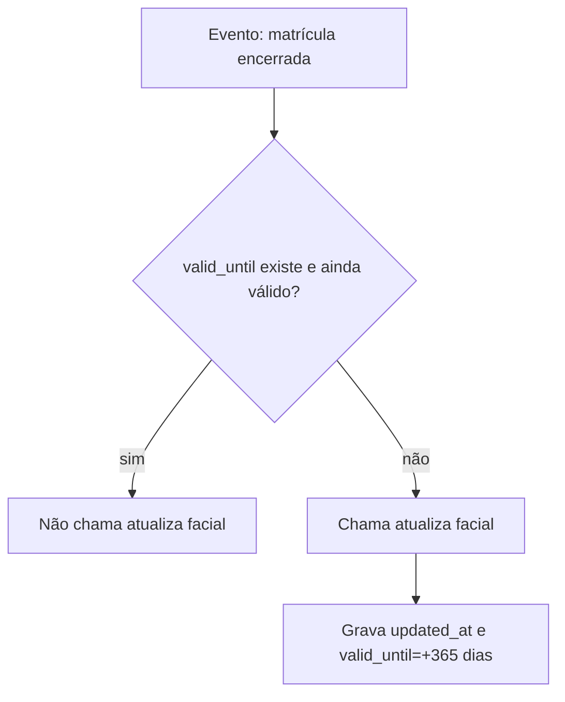

# Estudo: fluxo de matrícula e enturmação no i-Educar

Este documento é **para estudo local** (não pensado para versionar/commitar).

## Objetivo

Mapear, com base no código do i-Educar, o fluxo de:

- **Matrícula** de uma pessoa (aluno) no ano letivo (registro base).
- **Enturmação** (vínculo da matrícula com uma turma).
- **Situações/status** que a matrícula pode receber.
- **Inativação** (por mudança de situação e por cancelamento/exclusão).

---

## Conceitos e entidades (modelo mental)

No i-Educar existem dois “níveis” principais:

- **Matrícula**: registro base “aluno X matriculado na escola/série/ano”.
  - Tabela: `pmieducar.matricula`
  - Modelos/classes: `LegacyRegistration` (Eloquent), `clsPmieducarMatricula` (legado)
  - Campos relevantes (vistos em `clsPmieducarMatricula`):
    - `cod_matricula` (id)
    - `ref_cod_aluno`
    - `ref_ref_cod_escola` (escola)
    - `ref_ref_cod_serie` (série)
    - `ref_cod_curso` (curso)
    - `ano` (ano letivo)
    - `aprovado` (situação/status)
    - `ativo` (flag de registro ativo)
    - `data_matricula` (data de entrada)
    - `data_cancel` (data associada a saída/transferência/abandono, conforme fluxo)
    - `ultima_matricula` (flag da matrícula “corrente” do aluno)

- **Enturmação**: registro “dentro da matrícula”, vinculando a uma turma, com data de entrada e (quando sai) data de exclusão.
  - Tabela: `pmieducar.matricula_turma`
  - Modelos/classes: `LegacyEnrollment` (Eloquent), `clsPmieducarMatriculaTurma` (legado)
  - Campos relevantes:
    - `ref_cod_matricula` (FK para matrícula)
    - `ref_cod_turma` (FK para turma)
    - `data_enturmacao` (data de entrada na turma)
    - `data_exclusao` (data de saída da turma)
    - `ativo` (flag de enturmação ativa)
    - `sequencial` / `sequencial_fechamento` (ordenação/controle)
    - flags de evento: `transferido`, `abandono`, `falecido`, `reclassificado`, `remanejado` etc.

**Resumo curto**

- Matrícula responde: “o aluno está matriculado?”
- Enturmação responde: “em qual turma e desde quando (e quando saiu)?”

---

## Diagrama de fluxo (alto nível)

```mermaid
flowchart TD
  A[Aluno existente e ativo] --> B[Cadastro de Matrícula]
  B --> C{Validações}
  C -->|ok| D[Cria pmieducar.matricula<br/>aprovado=3, ativo=1]
  C -->|erro| X[Exibe mensagem e aborta]

  D --> E{Turma informada?}
  E -->|não| F[Matrícula criada sem enturmação]
  E -->|sim| G[Enturmação]
  G --> H{Validações da enturmação<br/>data, horário, duplicidade}
  H -->|ok| I[Cria pmieducar.matricula_turma<br/>ativo=1, data_enturmacao]
  H -->|erro| Y[Enturmação não ocorre]

  D --> S[Atualizações posteriores de situação<br/>aprovado = ...]
  S --> T[Marca efeitos nas enturmações<br/>(flags e/ou desativação)]
  S --> U[Em transferência, grava data_cancel e cria solicitação]

  D --> Z[Cancelamento/Exclusão da matrícula]
  Z --> Z1[Desativa enturmações ativas<br/>ativo=0, data_exclusao]
  Z --> Z2[Marca matrícula como inativa<br/>ativo=0, data_exclusao]
```

---

## Fluxo de matrícula (telas legadas)

### Ponto central (UI legado)

- Arquivo: `ieducar/intranet/educar_matricula_cad.php`
- Papel: tela/ação clássica de criação/edição/exclusão de matrícula.

### Criação de matrícula

No fluxo de criação, o código constrói `clsPmieducarMatricula` setando, dentre outros:

- `aprovado = 3` (**Cursando**)
- `ativo = 1`
- `ano`, escola, série, curso e aluno
- `data_matricula` (validada contra início/fim do ano letivo)

E, se houver turma selecionada, chama a enturmação logo após cadastrar.

Trecho de referência:

- `ieducar/intranet/educar_matricula_cad.php` (procure por `new clsPmieducarMatricula(` e por `enturmacaoMatricula(`)

### Validações típicas (matrícula)

No mesmo arquivo aparecem validações como:

- **Aluno ativo**: não matricula aluno inativo/inexistente.
- **Data de fechamento**: bloqueia matrícula após data configurada.
- **Série destino**: pode bloquear matrícula fora da sequência de séries.
- **Ano letivo**: data de matrícula precisa respeitar início/fim do ano letivo (com exceção se instituição permitir).
- **Conflito de horário** (quando turma informada e censo exige).

> Observação: o arquivo é longo e mistura regras e integrações (eventos de matrícula, promoção etc.). Para estudo, navegue a partir do método de “Novo/Cadastrar” (onde faz `DB::beginTransaction()` e cria `clsPmieducarMatricula`).

---

## Enturmação (diferença vs matrícula)

### Ponto central (UI legado)

- Arquivo: `ieducar/intranet/educar_matricula_turma_cad.php`
- Papel: efetivar **nova enturmação**, **transferência de turma** e **remoção** (saída), alterando `pmieducar.matricula_turma`.

### Nova enturmação

O fluxo padrão:

1) valida data (não pode ser fora do ano letivo, nem antes de saídas/entradas inconsistentes)
2) valida conflito de horário (quando aplicável)
3) evita duplicidade de enturmação ativa na mesma turma
4) cria `clsPmieducarMatriculaTurma` com `ativo = 1` e `data_enturmacao`

Trecho de referência:

- `ieducar/intranet/educar_matricula_turma_cad.php` (método `novaEnturmacao`)

### Remover enturmação / saída da turma

Ao “remover” enturmação, o sistema marca:

- `pmieducar.matricula_turma.ativo = 0`
- `data_exclusao = data_enturmacao_informada_na_tela` (data de saída)

Trecho de referência:

- `ieducar/intranet/educar_matricula_turma_cad.php` (método `removerEnturmacao`)

### Transferir enturmação (trocar de turma)

O padrão é:

1) remover enturmação antiga (saída, `ativo=0`)
2) criar enturmação nova (entrada, `ativo=1`)

Trecho de referência:

- `ieducar/intranet/educar_matricula_turma_cad.php` (método `transferirEnturmacao`)

---

## Situações/status da matrícula

O status principal da matrícula é `pmieducar.matricula.aprovado`.

### Enum moderno

Arquivo: `app/Models/RegistrationStatus.php`

Valores mapeados (principais):

- `1` Aprovado
- `2` Reprovado
- `3` Cursando
- `4` Transferido
- `5` Reclassificado
- `6` Deixou de Frequentar (abandono)
- `7` Em exame
- `8` Aprovado após exame
- `10` Aprovado sem exame
- `11` Pré-matrícula
- `12` Aprovado com dependência
- `13` Aprovado pelo conselho
- `14` Reprovado por faltas
- `15` Falecido

### “Inativas” (conceito usado em regra de negócio)

No enum moderno, as situações consideradas “inativas” (para algumas regras) são:

- `6` Abandono
- `4` Transferido
- `15` Falecido

(ver `RegistrationStatus::getStatusInactive()`).

---

## Inativação de matrícula: dois significados diferentes

Na prática, “inativar matrícula” aparece em dois sentidos:

### 1) Inativar por **mudança de situação** (`aprovado`)

Aqui a matrícula permanece existente (e normalmente `ativo` permanece `1`), porém a situação muda para algo final/inativo, como:

- transferido
- abandono
- falecido
- reclassificado

#### Serviço central (Laravel)

Arquivo: `app/Services/RegistrationService.php`

Fluxo:

- `updateStatus(LegacyRegistration $registration, $data)`:
  - seta `aprovado = nova_situacao`
  - executa ações adicionais no `switch`:
    - **transferido**: marca enturmações como transferidas (flag), cria solicitação de transferência, grava `data_cancel`
    - **abandono/falecido/reclassificado**: marca enturmações com flags correspondentes

> Nota: em alguns pontos do legado, além das flags, a enturmação é desativada (`ativo=0`) e recebe data de saída.

#### Telas legadas que desativam enturmações em situações específicas

Exemplos encontrados:

- `ieducar/intranet/educar_abandono_cad.php`: ao registrar abandono, percorre enturmações ativas e marca `ativo=0` + registra marcação de abandono.
- `ieducar/intranet/educar_falecido_cad.php`: ao registrar falecimento, percorre enturmações ativas e marca `ativo=0` + registra marcação de falecimento.

### 2) Inativar por **cancelamento/exclusão do registro** (`ativo = 0`)

Aqui a matrícula é desativada como registro:

- `pmieducar.matricula.ativo = 0`
- `pmieducar.matricula.data_exclusao = NOW()` (no `excluir()` legado)

#### Fluxo clássico (UI legado)

Arquivo: `ieducar/intranet/educar_matricula_cad.php`, método `Excluir()`:

- primeiro chama uma rotina para **desativar enturmações** ativas da matrícula (`pmieducar.matricula_turma.ativo = 0`)
- depois chama `clsPmieducarMatricula->excluir()` (marca `data_exclusao` e usuário)
- e ainda pode reordenar sequenciais de turma (para manter ordenação após remoção)

Pontos de navegação:

- `educar_matricula_cad.php`: `desativaEnturmacoesMatricula(...)` e `Excluir()`
- `ieducar/intranet/include/pmieducar/clsPmieducarMatricula.inc.php`: método `excluir()`
- `ieducar/intranet/include/pmieducar/clsPmieducarMatriculaTurma.inc.php`: métodos de `edita()`/`cadastra()` e marcações (abandono/transferido/falecido etc.)

---

## “Caminhos” para seguir no código (trilha rápida)

### Matrícula (criar/editar/excluir)

- `ieducar/intranet/educar_matricula_cad.php`
- `ieducar/intranet/include/pmieducar/clsPmieducarMatricula.inc.php`
- Model: `App\Models\LegacyRegistration` (para fluxos Laravel)

### Enturmação (criar/remover/transferir)

- `ieducar/intranet/educar_matricula_turma_cad.php`
- `ieducar/intranet/include/pmieducar/clsPmieducarMatriculaTurma.inc.php`
- Service: `app/Services/EnrollmentService.php` (fluxos Laravel, regras e reordenação)

### Situação/status

- Enum moderno: `app/Models/RegistrationStatus.php`
- Enum legado: `ieducar/lib/App/Model/MatriculaSituacao.php`
- Service (efeitos colaterais ao mudar status): `app/Services/RegistrationService.php`

---

## Notas práticas (para entendimento de regras)

- É comum a matrícula ser criada com `aprovado = 3 (Cursando)` e depois mudar para um status final (aprovado, reprovado etc.).
- Enturmações podem existir em sequência dentro da mesma matrícula (trocas de turma ao longo do ano), por isso há `sequencial`, `data_enturmacao` e `data_exclusao`.
- Em “saídas” (abandono/falecimento/transferência), além de mudar a situação da matrícula, o sistema costuma refletir isso nas enturmações:
  - por **flags** (ex.: `transferido = true`)
  - e/ou por **desativação** (`ativo = 0`) com data de saída

---

## Sugestão de fluxo: chamar rotina `atualiza facial` ao encerrar matrícula (com validade de 365 dias)

### Requisito resumido

- Ao **encerrar** uma matrícula, deve ser chamada uma rotina **`atualiza facial`**.
- Essa rotina persiste uma **validade de 365 dias** (ex.: `valid_until = last_update + 365`).
- Se o aluno **muda de turma** (enturmação/transferência/remanejamento) ou é **aprovado/promovido e muda de turma**, **e ainda está dentro da validade**, a rotina **não** deve ser chamada (entende-se que os dados biométricos/“facial” continuam válidos).

### Definição prática de “encerrar matrícula” (gatilhos)

Para evitar chamadas indevidas em “movimentos” normais (troca de turma), o gatilho deve estar atrelado a eventos de **encerramento** da matrícula (mudança para situação final/inativa ou cancelamento).

Sugestão de tratar como “encerramento”:

- **Mudança de situação (`aprovado`) para saída/inativação**:
  - `TRANSFERRED (4)`
  - `ABANDONED (6)`
  - `DECEASED (15)`
  - (opcional, conforme regra local) “situação final do ano” como `APPROVED/REPROVED/...` quando o ciclo do ano fecha
- **Cancelamento/exclusão do registro**:
  - `pmieducar.matricula.ativo = 0` no fluxo de exclusão/cancelamento

> Observação: “aprovado/promovido” pode ser final de ano; o requisito destaca que a mera **troca de turma** (por promoção/remanejamento) não deve disparar se ainda válida.

### Regra de decisão (idempotência por validade)

Antes de chamar `atualiza facial`, avaliar:

- Se existe `facial_valid_until` (ou equivalente) para o aluno (ou para a matrícula, dependendo do desenho).
- Se `today <= facial_valid_until`: **não chama**.
- Caso contrário: **chama** e grava:
  - `facial_updated_at = now()`
  - `facial_valid_until = now() + 365 dias`

### Onde plugar no código (pontos recomendados)

**1) Encerramento por mudança de situação (Laravel)**

- Centralizar no serviço `app/Services/RegistrationService.php` no fluxo `updateStatus(...)`.
- No `switch` de `checkUpdatedStatusAction(...)`, após as ações específicas (ex.: criar solicitação de transferência), chamar um “orquestrador” do facial, por exemplo:
  - `FacialUpdateService::onRegistrationClosed($registration, $newStatus)`

Vantagens:

- Um único ponto para cobrir “transferido/abandono/falecido” (e outros finais, se desejado).
- Mantém a regra de validade fora das telas legadas.

**2) Encerramento por cancelamento/exclusão (legado)**

- No fluxo de exclusão em `ieducar/intranet/educar_matricula_cad.php` (`Excluir()`), após desativar enturmações e marcar matrícula como inativa, chamar o mesmo orquestrador (se o sistema ainda precisar cobrir esse caminho legado).

**3) NÃO plugar em enturmação**

- Evitar chamar `atualiza facial` em:
  - `educar_matricula_turma_cad.php` (nova/remover/transferir enturmação)
  - `EnrollmentService::enroll(...)` ou rotinas de reorder/remanejamento

Motivo: trocas de turma são rotineiras e devem respeitar a validade (não disparar se dentro de 365 dias).

### Sugestão de persistência (onde guardar validade)

Duas opções comuns (escolher uma, conforme domínio e auditoria):

- **Por aluno** (recomendado se o “facial” vale globalmente):
  - tabela/colunas: `student_facial.updated_at`, `student_facial.valid_until`
  - chave: `ref_cod_aluno`
- **Por matrícula** (se quiser “amarrar” ao ciclo/ano):
  - tabela/colunas: `pmieducar.matricula.facial_updated_at`, `pmieducar.matricula.facial_valid_until`
  - chave: `cod_matricula`

Se a regra diz “aluno mudou de turma/promoção” e não deve chamar se ainda válida, **por aluno** tende a ser mais aderente.

### Fluxo sugerido (pseudodiagrama)



