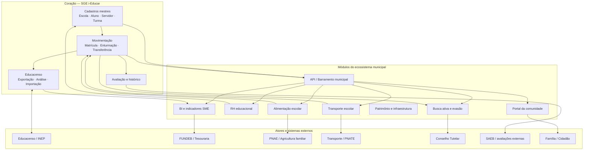

# Roadmap — Ecossistema educacional municipal com i-Educar (SGE)

> **Tipo:** Documento estratégico (local) · **Escopo:** Rede municipal pública de educação · **Status:** Proposta  
> **Local:** `tmp/` — não publicado no GitHub do pacote Educacenso; uso interno da implantação municipal  
> **Última revisão:** julho/2026

---

## 1. Propósito

Este roadmap descreve como organizar o **fluxo de dados** de uma **rede municipal de educação pública** tendo o **Sistema de Gestão Escolar (SGE)** — materializado pelo **i-Educar** — como **coração do ecossistema**: fonte canônica de alunos, servidores, escolas, turmas, matrículas, avaliação e histórico.

O objetivo não é substituir o i-Educar por vários sistemas paralelos, e sim **orbitar** módulos especializados que **consomem e devolvem** dados ao SGE, reduzindo retrabalho, inconsistência de cadastro e risco no **Educacenso** e na prestação de contas.

---

## 2. Contexto educacional brasileiro

### 2.1. O que uma SME municipal precisa sustentar

| Dimensão | Exigência / realidade | Implicação para dados |
|----------|----------------------|------------------------|
| **Oferta** | Escolas, turmas, vagas, turnos, EJA, EI, AEE, atividade complementar | Cadastro único de turma e matrícula; regras de coexistência (ex.: matrícula dupla regular + AEE) |
| **Censo Escolar (INEP)** | Matrícula Inicial, Situação do Aluno, layouts anuais | Sincronização de códigos INEP e situações; auditoria antes do envio |
| **Financiamento** | FUNDEB, complementação VAAF/VAAT/VAAR, PDDE | Indicadores por escola/aluno consistentes com matrícula ativa |
| **Avaliação** | SAEB, IDEB, avaliações internas, recuperação | Notas e situação final alinhadas à matrícula/enturmação |
| **RH** | Concursados, contratos, substitutos, lotação, frequência | Servidor vinculado à escola/turma/disciplina no mesmo ecossistema |
| **Alimentação** | PNAE — merenda, cardápio, prestadores | Quantidade de alunos por turno/etapa alimentada pelo SGE |
| **Transporte** | PNATE — rotas, veículos, alunos atendidos | Lista de matriculados elegíveis exportada do SGE |
| **Proteção** | Busca ativa, evasão, Conselho Tutelar | Eventos de movimentação (abandono, transferência) do SGE |
| **Transparência** | LAI, portais, TCE/TCU | Relatórios oficiais rastreáveis à base do SGE |
| **BNCC / currículo** | Componentes, séries, etapas | Parametrização central na SME, replicada nas escolas |

### 2.2. Problemas típicos sem ecossistema integrado

- Planilhas paralelas de matrícula, transporte e merenda com **números diferentes** do Censo.
- Cadastro de aluno **repetido** em sistemas de biblioteca, transporte ou portal.
- Retorno INEP importado **tarde** ou em formato errado (export vs retorno).
- SME sem visão consolidada: cada escola “fecha” dados de um jeito.
- Integrações pontuais (script, CSV manual) que **quebram** a cada ano letivo ou atualização do i-Educar.

### 2.3. Princípio orientador

```text
Um registro, uma verdade: aluno e matrícula nascem no SGE;
módulos satélites leem e escrevem de volta apenas o que lhes compete.
```

---

## 3. Visão do ecossistema — i-Educar no centro



---

## 4. Papéis no ecossistema

| Papel | Sistema | Responsabilidade de dados |
|-------|---------|---------------------------|
| **SGE (coração)** | i-Educar | Mestre: pessoa/aluno, servidor, escola, turma, matrícula, notas, histórico, permissões |
| **Compliance Censo** | i-Educar + pacotes Buriti/Portabilis | Exportação, análise, importação INEP, menus por ano/formato |
| **Configuração da rede** | Pacote setup municipal | EI, séries, perfis, calendário, regras locais (seeders parametrizados) |
| **Relatórios oficiais** | Jasper / pacote relatórios | Documentos escolares e administrativos com dados do SGE |
| **BI / Gestão** | Módulo ou ferramenta externa | Indicadores: matrícula, evasão, vagas, Censo, IDEB |
| **RH** | Módulo integrado ou SIGRH municipal | Lotação, afastamentos; espelho de servidor no i-Educar |
| **Transporte** | Sistema municipal de transporte | Rotas e passageiros **derivados** da matrícula ativa |
| **Merenda** | Sistema PNAE | Quantitativos por escola/turno **derivados** do SGE |
| **Portal** | Portal escola / app família | Consulta: frequência, boletim, comunicados (leitura do SGE) |
| **Barramento** | API municipal | Autenticação, filas, contratos de integração, auditoria |

---

## 5. Fluxos de dados prioritários

### 5.1. Fluxo vital — matrícula ao Censo

```text
Cadastro aluno (SGE)
    → Matrícula / enturmação (SGE)
    → Análise de exportação Educacenso (SGE)
    → Envio TXT ao INEP (portal federal)
    → Retorno identificação / migração (INEP)
    → Importação códigos INEP (pacote Buriti — por escola/formato)
    → 2ª etapa: situação do aluno (INEP → SGE)
    → BI / prestação de contas (leitura consolidada)
```

**Integração já iniciada no projeto:** `buriti/i-educar-educacenso-import-package` (menus 2025/2026, importação por escola, documentação de formatos e limitações).

### 5.2. Fluxo SME — rede consolidada

```text
Escolas operam no SGE (unidade)
    → SME consolida via relatórios + BI (rede)
    → Decisão: abertura de turma, remanejamento, busca ativa
    → Parametrização desce via setup seeders / configuração instituição
```

**Integração já iniciada:** perfis SME (`PerfisUsuariosMunicipioSeeder`), pacote setup (`i-educar-setup-package`).

### 5.3. Fluxos satélite (a construir)

| Origem | Destino | Dado | Frequência |
|--------|---------|------|------------|
| SGE | Transporte | Matrículas ativas, endereço, turno, necessidade PcD | Diária / sob demanda |
| SGE | Merenda | Contagem por escola, etapa, turno | Diária |
| SGE | BI | Snapshot matrícula, movimentação, Censo | Noturno |
| RH municipal | SGE | Servidor, matrícula funcional, lotação | Evento (admissão, transferência) |
| SGE | Busca ativa | Abandono, infrequência, transferência | Evento |
| Portal | SGE | Solicitação matrícula (opcional) | Workflow com validação humana |

---

## 6. Módulos e sistemas propostos

Cada módulo abaixo pode ser **pacote Laravel** (padrão Buriti), **serviço externo** integrado via API ou **extensão** do core — desde que respeite o SGE como mestre.

### Fase 0 — Fundação (em curso / consolidar)

| Módulo | Descrição | Entregáveis |
|--------|-----------|-------------|
| **SGE base** | i-Educar 2.11/2.12 implantado na rede | Instância única municipal, PostgreSQL, backups, filas |
| **Setup municipal** | Parametrização EI, EF, perfis, calendário | `i-educar-setup-package`, seeders por município |
| **Perfis e governança** | SME, secretaria, direção, professores | `PerfisUsuariosMunicipioSeeder`, documentação de permissões |
| **Educacenso import** | Retorno INEP por ano/formato/escola | Pacote Buriti Educacenso import + docs operacionais |
| **Relatórios** | Jasper, documentos legais | Pacote relatórios Portabilis/Serventec |
| **Infra** | Deploy, cache, Pulse, comandos produção | Docs `infraestrutura/COMANDOS-PRODUCAO.md` |

### Fase 1 — Dados confiáveis para o Censo (0–12 meses)

| # | Módulo | Problema que resolve | Integração com SGE |
|---|--------|----------------------|-------------------|
| 1.1 | **Auditoria pré-Censo** | Escola envia Censo com inconsistência | Dashboard sobre análise de exportação; checklist por escola |
| 1.2 | **Importação INEP robusta** | Fragilidades atuais (INEP escola, layout situação, jobs) | Evolução do pacote import: bloqueio sem INEP, fila, transação |
| 1.3 | **Cadastro único aluno** | Duplicidade de pessoa/aluno | Regras e rotina de unificação; validação CPF/NIS |
| 1.4 | **Matrícula dupla documentada** | Regular + AEE / atividade complementar | Fluxo operacional já documentado; validações no core |
| 1.5 | **API leitura matrícula** | Satélites pedem planilha | Endpoints: matrículas ativas por escola/ano/turno |

### Fase 2 — Gestão da rede (12–24 meses)

| # | Módulo | Problema que resolve | Integração com SGE |
|---|--------|----------------------|-------------------|
| 2.1 | **BI educacional municipal** | SME sem visão em tempo real | ETL noturno do PostgreSQL do i-Educar; Metabase/Grafana/Superset |
| 2.2 | **Indicadores Censo + matrícula** | Divergência entre “número da escola” e INEP | Painel: exportado vs importado vs matrícula ativa |
| 2.3 | **Busca ativa e evasão** | Abandono detectado tarde | Consome movimentações e frequência; gera fila de visitas |
| 2.4 | **Central de documentos** | Histórico, ata, declarações | Jasper + armazenamento; metadados do aluno no SGE |
| 2.5 | **Workflow SME** | Aprovação de remanejamento, turma nova | Tickets ligados a `cod_escola` / ano letivo |

### Fase 3 — Serviços periféricos integrados (24–36 meses)

| # | Módulo | Problema que resolve | Integração com SGE |
|---|--------|----------------------|-------------------|
| 3.1 | **Transporte escolar** | Lista de passageiros desatualizada | Import diário de matrículas; geocodificação de endereço do aluno |
| 3.2 | **Alimentação (PNAE)** | Contagem de comensais errada | Quantitativos por turno/etapa a partir de matrícula ativa |
| 3.3 | **RH educacional** | Servidor duplicado SGE × folha | Sincronização servidor/lotação; afastamento reflete em quadro |
| 3.4 | **Patrimônio escolar** | Bens por unidade sem vínculo institucional | Cadastro de bens por `cod_escola` |
| 3.5 | **Portal família** | Pais ligam na escola por nota/frequência | SSO municipal; leitura boletim, calendário, comunicados |

### Fase 4 — Ecossistema maduro (36+ meses)

| # | Módulo | Problema que resolve | Integração com SGE |
|---|--------|----------------------|-------------------|
| 4.1 | **Barramento municipal (API hub)** | Integrações frágeis ponto a ponto | Contratos OpenAPI, filas, idempotência, logs |
| 4.2 | **Data lake educacional** | Histórico longitudinal para políticas públicas | Snapshots anuais; anonimização para pesquisa |
| 4.3 | **Matrícula online regulada** | Fila de espera, vagas | Pré-matrícula com validação da secretaria no SGE |
| 4.4 | **Interoperabilidade estadual** | Sistemas da SEDUC | Adaptadores por estado (quando exigido) |
| 4.5 | **Observatório PME** | Plano Municipal de Educação | Metas do PME alimentadas por indicadores do BI |

---

## 7. Arquitetura de integração recomendada

### 7.1. Camadas

```text
┌─────────────────────────────────────────────────────────┐
│  Canais: Portal, App, WhatsApp (futuro), Atendimento SME │
├─────────────────────────────────────────────────────────┤
│  Módulos satélite: Transporte, Merenda, BI, Busca ativa │
├─────────────────────────────────────────────────────────┤
│  Integração: API REST / eventos / filas (Redis/Horizon) │
├─────────────────────────────────────────────────────────┤
│  SGE i-Educar: cadastros, movimentação, avaliação, Censo│
├─────────────────────────────────────────────────────────┤
│  PostgreSQL · Redis · Armazenamento de arquivos           │
└─────────────────────────────────────────────────────────┘
```

### 7.2. Regras de integração

1. **Escrita mestre:** aluno, matrícula, turma, nota final → somente SGE (ou pacote autorizado com transação explícita).
2. **Leitura ampla:** satélites consultam via API ou view materializada; evitar SQL ad hoc em produção.
3. **Eventos:** toda movimentação relevante (matrícula, abandono, transferência) publica evento para BI e busca ativa.
4. **Identificadores:** usar `cod_aluno`, `cod_matricula`, `cod_escola`, INEP como chaves de correlação entre sistemas.
5. **Ano letivo:** todas as integrações devem receber `ano` explicitamente — nunca assumir ano corrente em silêncio.

### 7.3. Pacotes Laravel (padrão atual Buriti)

| Pacote | Função no ecossistema | Status |
|--------|----------------------|--------|
| `i-educar-setup-package` | Parametrização municipal inicial | Existente |
| `i-educar-educacenso-import-package` | Importação retorno INEP | Existente |
| Relatórios Jasper | Documentos e impressos | Em implantação |
| `i-educar-api-municipal-package` *(proposto)* | API leitura/escrita controlada para satélites | Roadmap Fase 1 |
| `i-educar-bi-export-package` *(proposto)* | Views/exports para BI | Roadmap Fase 2 |
| `i-educar-busca-ativa-package` *(proposto)* | Evasão e acompanhamento | Roadmap Fase 2 |

---

## 8. Roadmap por trimestre (sugestão)

### T1 — Consolidar o coração

- [ ] i-Educar 2.11 homologado; plano de upgrade 2.12
- [ ] Setup municipal completo (EI, perfis, calendário 2026)
- [ ] Educacenso: exportação + importação com escola piloto
- [ ] Documentação operacional SME (perfis, matrícula dupla, Censo 2026)
- [ ] Backup, monitoramento, rotina `COMANDOS-PRODUCAO`

### T2 — Censo confiável

- [ ] Corrigir fragilidades prioritárias do import (INEP escola, situação, fila)
- [ ] Rotina SME: calendário Censo, checklist por escola
- [ ] Relatórios críticos em Jasper (matrícula, movimento, ata)
- [ ] Primeira versão API leitura: matrículas ativas por escola

### T3 — Visão da rede

- [ ] BI com indicadores: matrícula, vaga, evasão, status Censo
- [ ] Protótipo busca ativa (lista de infrequência/abandono)
- [ ] Unificação de cadastro: procedimento para duplicatas

### T4 — Primeiro satélite

- [ ] Integração transporte **ou** merenda (escolher um piloto)
- [ ] Contrato de dados e SLA entre SME e escolas
- [ ] Portal leitura (boletim / calendário) se houver demanda

### Ano 2+

- Segundo satélite; RH; barramento API; matrícula online regulada

---

## 9. Governança de dados na rede municipal

| Decisão | Responsável | Registro |
|---------|-------------|----------|
| Abertura de turma | SME pedagógico | Ata / processo no SGE |
| Prazo fechamento matrícula | SME + escolas | Calendário escolar |
| Responsável Censo por escola | Direção + secretaria | Checklist INEP |
| Perfis de acesso | TI + SME | `PERFIS-USUARIOS-MUNICIPIO` |
| Integração nova (transporte, etc.) | TI municipal | Contrato API + DPA |
| Qualidade de cadastro | SME + escolas | Auditoria trimestral |

---

## 10. Riscos e mitigações

| Risco | Impacto | Mitigação |
|-------|---------|-----------|
| Escolas mantêm planilha paralela | Censo inconsistente | BI compara planilha × SGE; treinamento |
| Import INEP em formato errado | Situação/código incorreto | Menus por formato + docs `FORMATOS-CENSO-2026` |
| Múltiplos sistemas escrevendo aluno | Duplicidade | SGE único mestre; API com escopo limitado |
| Rotatividade de secretaria | Dados ruins | Perfis padronizados, manuais por fluxo |
| Atualização i-Educar | Quebra de pacotes | Matriz compatibilidade 2.11/2.12; testes homologação |
| Sobrecarga servidor no Censo | Timeout importação | Filas assíncronas (evolução pacote import) |

---

## 11. Métricas de sucesso do ecossistema

| Indicador | Meta orientativa |
|-----------|------------------|
| % matrículas ativas com código INEP aluno | > 98% antes do fechamento Censo |
| Divergência matrícula SGE × exportação Censo | < 1% por escola |
| Tempo médio importação retorno INEP (por escola) | < 15 min operacionais |
| Escolas usando apenas SGE (sem planilha paralela de matrícula) | 100% em 18 meses |
| Integrações satélite consumindo API (não CSV manual) | ≥ 2 módulos em 24 meses |
| Documentos escolares via Jasper (não Word avulso) | Modelos padronizados municipal |

---

## 12. Conexão com o trabalho já realizado neste repositório

| Artefato existente | Papel no ecossistema |
|--------------------|----------------------|
| `buriti/i-educar-educacenso-import-package` | Módulo **Compliance Censo** — importação retorno INEP 2025/2026 |
| `buriti/i-educar-setup-package` | Módulo **Fundação** — parametrização municipal |
| `docs/operacao/MATRICULA-DUPLA-...` | Regra de negócio local integrada ao SGE |
| `docs/administracao/PERFIS-USUARIOS-MUNICIPIO.md` | Governança de acesso SME ↔ escola |
| `docs/relatorios/` | Camada **documentos** do ecossistema |
| `docs/infraestrutura/COMANDOS-PRODUCAO.md` | Operação do coração em produção |

---

## 13. Próximos passos recomendados

1. **Validar** este roadmap com SME (pedagógico, Censo, TI, financeiro).
2. **Priorizar** Fase 1 com data do calendário Educacenso 2026.
3. **Nomear** responsáveis: dono do SGE, dono do Censo, dono da integração.
4. **Escolher** um município piloto (3–5 escolas) antes de rede completa.
5. **Especificar** `i-educar-api-municipal-package` (endpoints mínimos Fase 1).
6. Manter documentos estratégicos em `tmp/` ou `docs/estrategia/` **locais** até aprovação institucional.

---

## Ver também

- [Documentação i-Educar](../docs/README.md)
- [Formatos Censo 2026](../packages/buriti/i-educar-educacenso-import-package/docs/FORMATOS-CENSO-2026.md)
- [Perfis usuário município](../docs/administracao/PERFIS-USUARIOS-MUNICIPIO.md)
- [Matrícula dupla regular + AEE](../docs/operacao/MATRICULA-DUPLA-REGULAR-AEE-ATIVIDADE-COMPLEMENTAR.md)
